# Execution Plan - 테이블오더 서비스

## Detailed Analysis Summary

### Change Impact Assessment
- **User-facing changes**: Yes - 고객 주문 UI, 관리자 대시보드 전체 신규 개발
- **Structural changes**: Yes - 전체 시스템 아키텍처 신규 설계 (프론트엔드 + 백엔드 + DB)
- **Data model changes**: Yes - 9개 핵심 엔티티 신규 설계
- **API changes**: Yes - REST API 전체 신규 설계 + SSE 실시간 통신
- **NFR impact**: Yes - 1000+ 동시접속, 보안(JWT, bcrypt), 실시간 통신

### Risk Assessment
- **Risk Level**: Medium
- **Rollback Complexity**: Easy (Greenfield - 롤백 불필요)
- **Testing Complexity**: Complex (실시간 통신, 세션 관리, 다중 사용자 시나리오)

---

## Workflow Visualization

```mermaid
flowchart TD
    Start(["User Request"])
    
    subgraph INCEPTION["INCEPTION PHASE"]
        WD["Workspace Detection<br/>COMPLETED"]
        RA["Requirements Analysis<br/>COMPLETED"]
        US["User Stories<br/>COMPLETED"]
        WP["Workflow Planning<br/>COMPLETED"]
        AD["Application Design<br/>EXECUTE"]
        UG["Units Generation<br/>EXECUTE"]
    end
    
    subgraph CONSTRUCTION["CONSTRUCTION PHASE"]
        FD["Functional Design<br/>EXECUTE"]
        NFRA["NFR Requirements<br/>EXECUTE"]
        NFRD["NFR Design<br/>EXECUTE"]
        CP["Code Generation<br/>EXECUTE"]
        BT["Build and Test<br/>EXECUTE"]
    end
    
    Start --> WD
    WD --> RA
    RA --> US
    US --> WP
    WP --> AD
    AD --> UG
    UG --> FD
    FD --> NFRA
    NFRA --> NFRD
    NFRD --> CP
    CP --> BT
    BT --> End(["Complete"])

    style WD fill:#4CAF50,stroke:#1B5E20,stroke-width:3px,color:#fff
    style RA fill:#4CAF50,stroke:#1B5E20,stroke-width:3px,color:#fff
    style US fill:#4CAF50,stroke:#1B5E20,stroke-width:3px,color:#fff
    style WP fill:#4CAF50,stroke:#1B5E20,stroke-width:3px,color:#fff
    style AD fill:#FFA726,stroke:#E65100,stroke-width:3px,stroke-dasharray: 5 5,color:#000
    style UG fill:#FFA726,stroke:#E65100,stroke-width:3px,stroke-dasharray: 5 5,color:#000
    style FD fill:#FFA726,stroke:#E65100,stroke-width:3px,stroke-dasharray: 5 5,color:#000
    style NFRA fill:#FFA726,stroke:#E65100,stroke-width:3px,stroke-dasharray: 5 5,color:#000
    style NFRD fill:#FFA726,stroke:#E65100,stroke-width:3px,stroke-dasharray: 5 5,color:#000
    style CP fill:#4CAF50,stroke:#1B5E20,stroke-width:3px,color:#fff
    style BT fill:#4CAF50,stroke:#1B5E20,stroke-width:3px,color:#fff
    style Start fill:#CE93D8,stroke:#6A1B9A,stroke-width:3px,color:#000
    style End fill:#CE93D8,stroke:#6A1B9A,stroke-width:3px,color:#000
    style INCEPTION fill:#BBDEFB,stroke:#1565C0,stroke-width:3px,color:#000
    style CONSTRUCTION fill:#C8E6C9,stroke:#2E7D32,stroke-width:3px,color:#000
    linkStyle default stroke:#333,stroke-width:2px
```



### Text Alternative
```
Phase 1: INCEPTION
- Workspace Detection (COMPLETED)
- Requirements Analysis (COMPLETED)
- User Stories (COMPLETED)
- Workflow Planning (COMPLETED)
- Application Design (EXECUTE)
- Units Generation (EXECUTE)

Phase 2: CONSTRUCTION (per-unit)
- Functional Design (EXECUTE)
- NFR Requirements (EXECUTE)
- NFR Design (EXECUTE)
- Infrastructure Design (SKIP)
- Code Generation (EXECUTE)
- Build and Test (EXECUTE)
```

---

## Phases to Execute

### INCEPTION PHASE
- [x] Workspace Detection (COMPLETED)
- [x] Requirements Analysis (COMPLETED)
- [x] User Stories (COMPLETED)
- [x] Workflow Planning (IN PROGRESS)
- [ ] Application Design - **EXECUTE**
  - **Rationale**: 신규 프로젝트로 컴포넌트 식별, 서비스 레이어 설계, 컴포넌트 간 의존성 정의 필요
- [ ] Units Generation - **EXECUTE**
  - **Rationale**: 복잡한 시스템으로 백엔드/프론트엔드를 독립적 유닛으로 분리하여 체계적 구현 필요

### CONSTRUCTION PHASE (per-unit)
- [ ] Functional Design - **EXECUTE**
  - **Rationale**: 9개 엔티티의 데이터 모델, 비즈니스 로직(세션 관리, 주문 상태 흐름) 상세 설계 필요
- [ ] NFR Requirements - **EXECUTE**
  - **Rationale**: 1000+ 동시접속, 보안(Security Extension 전체 적용), 실시간 통신 등 NFR 요구사항 존재
- [ ] NFR Design - **EXECUTE**
  - **Rationale**: NFR Requirements에서 도출된 패턴을 설계에 반영 필요
- [ ] Infrastructure Design - **SKIP**
  - **Rationale**: AWS 배포 환경이지만 MVP 단계에서는 로컬 개발 환경 우선. 인프라 설계는 추후 별도 진행
- [ ] Code Generation - **EXECUTE** (ALWAYS)
  - **Rationale**: 실제 코드 구현 필수
- [ ] Build and Test - **EXECUTE** (ALWAYS)
  - **Rationale**: 빌드 및 테스트 검증 필수

### OPERATIONS PHASE
- [ ] Operations - **PLACEHOLDER**
  - **Rationale**: 향후 배포/모니터링 워크플로우 확장 예정

---

## Success Criteria
- **Primary Goal**: 테이블오더 MVP 서비스 완성 (고객 주문 + 관리자 운영)
- **Key Deliverables**:
  - React 프론트엔드 (고객용 + 관리자용)
  - Spring Boot 백엔드 (REST API + SSE)
  - PostgreSQL 데이터베이스 스키마
  - 단위 테스트 (커버리지 80%+)
- **Quality Gates**:
  - 모든 API 엔드포인트 동작 확인
  - Security Extension 규칙 준수
  - 단위 테스트 통과
  - 빌드 성공
